# NAVIST
<h1 align="center"> Navist 2023 Google Developer Student Club (Gombe State University, Nigeria), Solution Challenge</h1>

  

## Introduction 🙋‍♂️
> Navigation assistant and virtual intelligence for students **(Navist)** is a **web app** that utilizes the use of google technologies to help students (especially freshers) navigate campus and provide them with free and easy access to learning materials such as: 
- handouts, 
- past exams questions 
- And past test question
# Global Todolist
| Goals4  | Goals9 | Goals10 | Goals17 |
| ------------- | ------------- | ------------- |
| 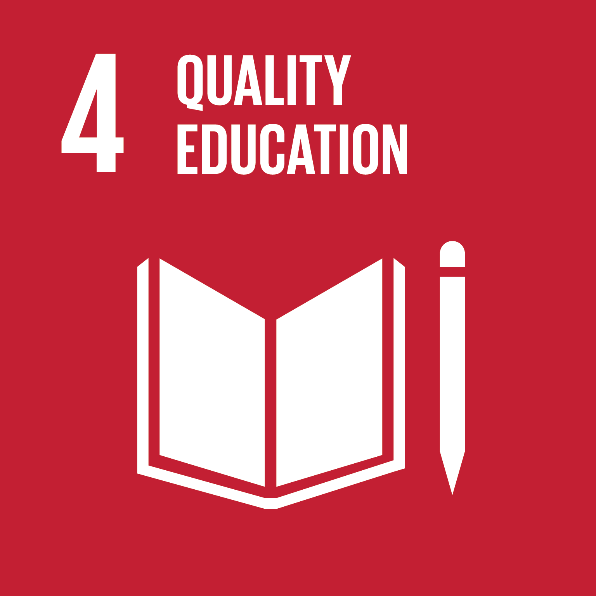  | 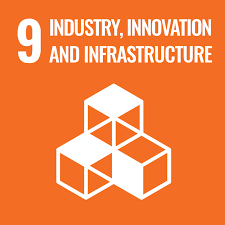 | 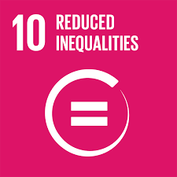  |  |
### The use of technology such as Navist, can contribute to achieving several of the United Nations' Sustainable Development Goals (SDGs), including:

- **SDG 4**: Quality Education: Navist can provide students with access to educational resources and support their learning, which can improve educational outcomes and promote lifelong learning.

- **SDG 9:** Industry, Innovation and Infrastructure: The development of technology-based solutions, such as Navist, can promote innovation and contribute to the development of sustainable infrastructure.

- **SDG 10**: Reduced Inequalities: Navist can provide equal access to learning resources and support for all students, regardless of their socio-economic status or location.

- **SDG 17**: Partnerships for the Goals: Collaboration between universities, technology companies, and other stakeholders can help to develop and implement technology-based solutions such as Navist.

## We chose these specific SDGs and targets because 
Navist can potentially address several targets under SDG 4: Quality Education. Here are some of the specific targets that Navist can contribute to:

### Target 4.1: 
By 2030, ensure that all girls and boys complete free, equitable and quality primary and secondary education leading to relevant and effective learning outcomes.

**Navist can support this target by providing students with access to learning materials and support, which can help them to achieve better learning outcomes.**

### Target 4.3: 
By 2030, ensure equal access for all women and men to affordable and quality technical, vocational and tertiary education, including university.

**Navist can contribute to this target by providing all students, regardless of their socio-economic status or location, with equal access to learning resources and support**.

### Target 4.5: 
By 2030, eliminate gender disparities in education and ensure equal access to all levels of education and vocational training for the vulnerable, including persons with disabilities, indigenous peoples and children in vulnerable situations.

**Navist can support this target by providing equal access to learning resources and support for all students, including those who may face barriers to accessing education.**

### Target 4.b: 
By 2020, substantially expand globally the number of scholarships available to developing countries, in particular least developed countries, small island developing States and African countries, for enrolment in higher education, including vocational training and information and communications technology, technical, engineering and scientific programmes, in developed countries and other developing countries.

While this target has a specific focus on scholarships, **Navist can still contribute to this goal by providing access to educational resources, including information and communications technology, to students in developing countries and supporting their learning.**

Overall, Navist can contribute to achieving several SDGs, particularly those related to **education**, **innovation**, and **reducing inequalities**. By supporting students in their learning and navigation on campus, Navist can contribute to the development of a more equitable and sustainable world.

## Application Screenshots

|  Home Page | Locations | Faculties  |
| ------------- | ------------- | ------------- |
| 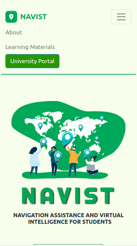)   |   |  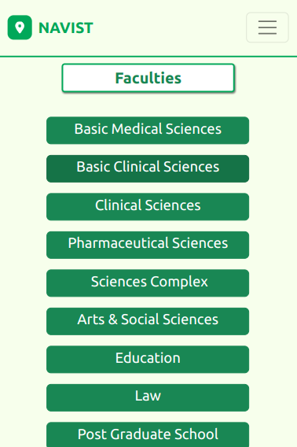  |

| Unit | Lecture Theathers  | location |
| ------------- | ------------- | ------------- |
|  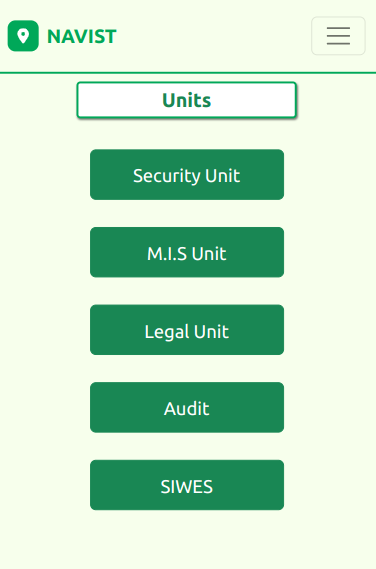 | 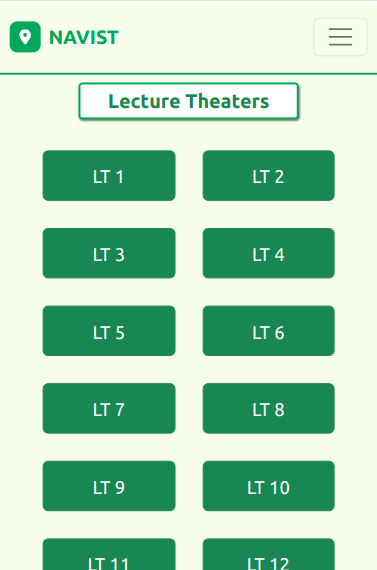 | 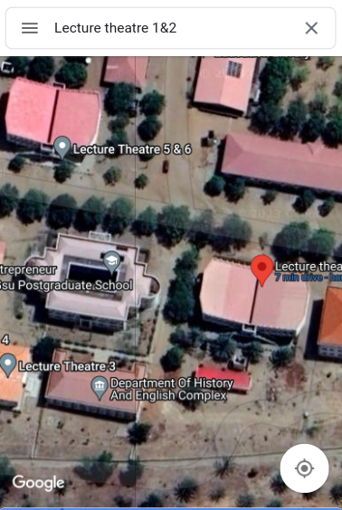  |

| materials  | 100 level | Biology |
| ------------- | ------------- | ------------- |
| 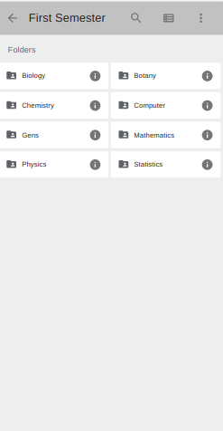  | 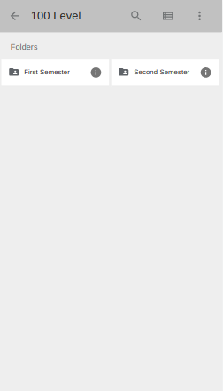  | 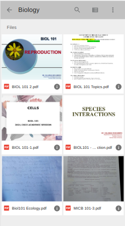  |

# Technology Used
| firebase  | Google Map | Google Drive |
| ------------- | ------------- | ------------- |
|   |   |   |

## Shoutout
- To [Mallam muhammad dawaki](https://www.google.com/maps/contrib/114799831498403795750/reviews/@9.0937473,9.7493247,7z/data=!3m1!4b1!4m3!8m2!3m1!1e1?hl=en-US)  his Contribution to google map have been a major factor in the success of this project, and I am deeply grateful for your efforts

   By sharing his experience, you have helped to make this process more efficient and effective.

- To our chapter Lead [Umar Abdullahi](https://github.com/umarbrowser) how always there for us 